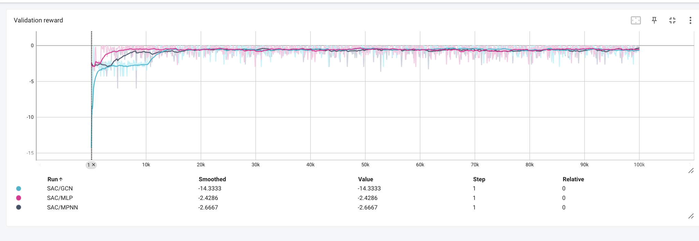
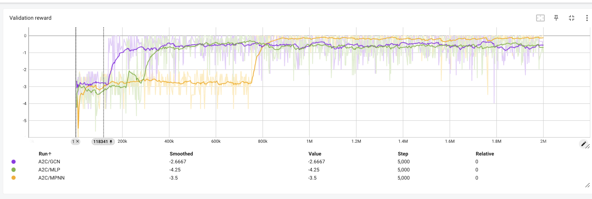
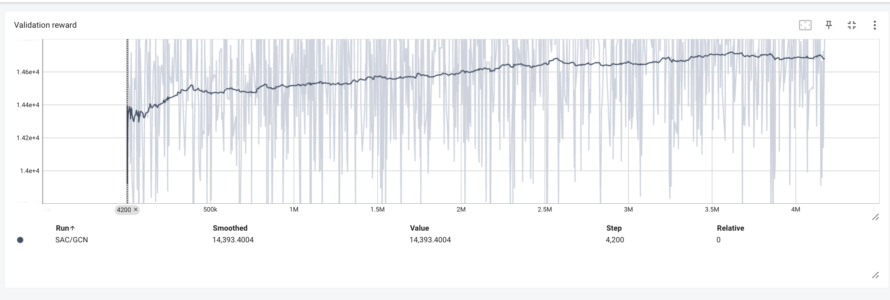

# Coming Soon!
</td>  

# Codebase
This repository provides examples of the Bi-Level RL approach, implemented using stable baselines.
We provide a simple example of solving a network flow problem (in this case just a single commodity, so it is equivalent to the shortest paths problem) using our Bi-level RL approach. We also provide a more complicated autonomous mobility on demand example.

To train a model for the network flow problem, you can run `main_network_flow.py`. By default, this will try every combination of training an agent using SAC, PPO, or A2C, each with a graph convolution network, a message passing network, and an MLP. Checkpoints are automatically saved in the network_flow_checkpoints folder, and validation reward (from deterministic actions) is saved in the network_flow_runs folder.

</td>  
</td>  
*Validation reward for the network flow problem. The first graph represents SAC, run with three different neural networks. The second graph represents A2C, run with the same three neural networks. A2C with a graph convolution network (yellow) acheives the highest validation reward. This is likely because the graph convolution network is the only one that takes in edge features (travel times). SAC likely doesn't work as well as A2C for this problem because it doesn't work well with sparse reward.*

To train a policy for the autonomous mobility on demand problem, simply run
python3 `main_amod.py`. By default, this uses a graph convolution network with SAC, but you can change the RL algorithm or network by modifying the variables in main_amod.py. Checkpoints are automatically saved in the amod_checkpoints folder, and validation reward (from deterministic actions) is saved in the amod_runs folder.

</td>  
*Validation reward for the AMoD problem. This was trained on San Francisco, with SAC using a GCN.*